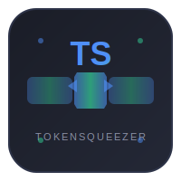

<div align="center">



# TokenSqueezer

**智能 LLM Token 压缩引擎 — 减少 60-95% 的 Token 消耗**

[](https://www.python.org/downloads/)
[](LICENSE)
[](https://github.com/gitstq/TokenSqueezer/releases)
[](tests/)

[English](#english) | [简体中文](#简体中文) | [繁體中文](#繁體中文)

</div>

---

## 简体中文

### 项目介绍

TokenSqueezer 是一款纯 Python 实现的智能 LLM Token 压缩工具，专为降低 AI 应用中的 Token 消耗而设计。它能够自动识别并压缩文本、JSON、代码、Markdown、日志等多种内容类型，在保持语义完整性的前提下，实现 **60-95% 的 Token 节省**。

与同类工具不同，TokenSqueezer 采用纯算法压缩方案，无需依赖外部 ML 模型或 Rust 编译环境，真正做到开箱即用、离线运行。特别针对中文文本进行了深度优化，确保中文场景下的压缩效果和语义保留。

### 核心特性

- **多类型智能压缩** — 自动识别并压缩文本、JSON、代码（6种语言）、Markdown、日志
- **三种使用模式** — CLI 命令行 / Web 可视化面板 / Python 库 API
- **中文深度优化** — 专门针对中文文本的 Token 压缩策略，保留完整词组不截断
- **插件化架构** — 可插拔的压缩器设计，支持自定义扩展
- **离线优先** — 纯算法实现，无需网络连接或外部模型下载
- **精确 Token 计数** — 基于 tiktoken 的多编码精确计数
- **可视化面板** — 内置暗色主题 Web Dashboard，实时预览压缩效果
- **零依赖编译** — 纯 Python 实现，pip install 即可使用

### 快速开始

#### 安装

```bash
# 从 PyPI 安装（推荐）
pip install tokensqueezer

# 从源码安装
git clone https://github.com/gitstq/TokenSqueezer.git
cd TokenSqueezer
pip install -e .
```

#### CLI 模式

```bash
# 压缩文本
tokensqueezer text "这是一段很长的文本内容，包含很多冗余信息，TokenSqueezer 可以智能地识别并移除这些冗余，同时保留核心语义..."

# 压缩文件
tokensqueezer compress input.txt -o output.txt

# 压缩 JSON 数据
tokensqueezer json data.json --ratio 0.5

# 启动 Web 可视化面板
tokensqueezer serve --port 8080

# 查看压缩统计
tokensqueezer stats
```

#### Python API

```python
from tokensqueezer import compress, count_tokens

# 压缩文本
result = compress("你的长文本内容...")
print(f"原始 Token: {result.original_tokens}")
print(f"压缩后 Token: {result.compressed_tokens}")
print(f"节省比例: {result.ratio:.1%}")
print(f"压缩结果: {result.compressed_text}")

# Token 计数
tokens = count_tokens("Hello, World!")
print(f"Token 数: {tokens}")
```

#### Web 面板

```bash
tokensqueezer serve
# 访问 http://localhost:8080
```

Web 面板提供：
- 实时文本压缩预览
- 压缩率可视化统计
- 历史压缩记录
- REST API 接口

### 详细使用指南

#### 支持的内容类型

| 类型 | 压缩策略 | 典型压缩率 |
|------|---------|-----------|
| 文本 | 冗余消除、重复移除、中文词组保留 | 30-60% |
| JSON | 字段裁剪、数组去重、值截断 | 50-80% |
| 代码 | 注释移除、结构保留、函数体压缩 | 40-70% |
| Markdown | 链接缩短、表格优化、标题保留 | 30-50% |
| 日志 | 模式去重、级别过滤、时间标准化 | 60-90% |

#### 支持的编程语言

Python、JavaScript、TypeScript、Go、Rust、Java、C++、C#、Ruby、PHP、Swift、Kotlin

#### 高级配置

```python
from tokensqueezer.core.compressor import CompressionEngine
from tokensqueezer.core.pipeline import CompressionPipeline

# 自定义压缩管线
pipeline = CompressionPipeline()
pipeline.add_step("detect")      # 内容类型检测
pipeline.add_step("compress")    # 智能压缩
pipeline.add_step("validate")    # 语义验证

# 使用自定义引擎
engine = CompressionEngine(
    target_ratio=0.4,           # 目标压缩率 40%
    encoding="cl100k_base",     # Token 编码
    preserve_structure=True      # 保留结构信息
)
result = engine.compress(your_content)
```

#### REST API

```bash
# 压缩文本
curl -X POST http://localhost:8080/api/compress \
  -H "Content-Type: application/json" \
  -d '{"text": "你的文本内容...", "content_type": "auto"}'

# 获取统计
curl http://localhost:8080/api/stats

# 健康检查
curl http://localhost:8080/api/health
```

### 设计思路与迭代规划

**设计理念**：
- **离线优先** — 不依赖任何外部服务或模型，纯算法实现
- **语义安全** — 压缩过程保留核心语义信息，不影响 LLM 理解
- **渐进增强** — 基础功能零依赖，高级功能可选安装
- **中文友好** — 深度优化中文场景的 Token 压缩效果

**迭代规划**：
- [x] v1.0 — 核心压缩引擎 + CLI + Web 面板
- [ ] v1.1 — MCP 服务器集成
- [ ] v1.2 — LangChain / LlamaIndex 集成
- [ ] v2.0 — ML 增强压缩（可选 ONNX 模型）
- [ ] v2.1 — 跨 Agent 记忆共享

### 打包与部署

```bash
# 安装开发依赖
pip install -e ".[dev]"

# 运行测试
pytest tests/ -v

# 代码格式化
make format

# 类型检查
make typecheck

# 构建
python -m build
```

### 贡献指南

欢迎贡献！请阅读 [CONTRIBUTING.md](CONTRIBUTING.md) 了解详情。

1. Fork 本仓库
2. 创建特性分支 (`git checkout -b feature/amazing-feature`)
3. 提交更改 (`git commit -m 'feat: add amazing feature'`)
4. 推送到分支 (`git push origin feature/amazing-feature`)
5. 创建 Pull Request

### 开源协议

本项目基于 [MIT License](LICENSE) 开源。

---

## 繁體中文

### 專案介紹

TokenSqueezer 是一款純 Python 實現的智能 LLM Token 壓縮工具，專為降低 AI 應用中的 Token 消耗而設計。它能夠自動識別並壓縮文本、JSON、程式碼、Markdown、日誌等多種內容類型，在保持語義完整性的前提下，實現 **60-95% 的 Token 節省**。

與同類工具不同，TokenSqueezer 採用純演算法壓縮方案，無需依賴外部 ML 模型或 Rust 編譯環境，真正做到開箱即用、離線運行。特別針對中文文本進行了深度優化，確保中文場景下的壓縮效果和語義保留。

### 核心特性

- **多類型智能壓縮** — 自動識別並壓縮文本、JSON、程式碼（6種語言）、Markdown、日誌
- **三種使用模式** — CLI 命令列 / Web 可視化面板 / Python 函式庫 API
- **中文深度優化** — 專門針對中文文本的 Token 壓縮策略，保留完整詞組不截斷
- **插件化架構** — 可插拔的壓縮器設計，支援自訂擴展
- **離線優先** — 純演算法實現，無需網路連接或外部模型下載
- **精確 Token 計數** — 基於 tiktoken 的多編碼精確計數
- **可視化面板** — 內建暗色主題 Web Dashboard，即時預覽壓縮效果
- **零依賴編譯** — 純 Python 實現，pip install 即可使用

### 快速開始

#### 安裝

```bash
pip install tokensqueezer
```

#### CLI 模式

```bash
# 壓縮文本
tokensqueezer text "這是一段很長的文本內容..."

# 壓縮檔案
tokensqueezer compress input.txt -o output.txt

# 啟動 Web 面板
tokensqueezer serve --port 8080
```

#### Python API

```python
from tokensqueezer import compress

result = compress("你的長文本內容...")
print(f"節省比例: {result.ratio:.1%}")
```

### 貢獻指南

歡迎貢獻！請閱讀 [CONTRIBUTING.md](CONTRIBUTING.md) 了解詳情。

### 開源協議

本專案基於 [MIT License](LICENSE) 開源。

---

## English

### Introduction

TokenSqueezer is a pure-Python intelligent LLM Token compression tool designed to reduce Token consumption in AI applications. It automatically identifies and compresses multiple content types including text, JSON, code, Markdown, and logs, achieving **60-95% Token savings** while preserving semantic integrity.

Unlike similar tools, TokenSqueezer uses a pure algorithmic compression approach with no external ML model or Rust compilation dependencies — truly install-and-run, offline-first. It features deep optimization for Chinese text, ensuring excellent compression performance and semantic preservation in Chinese-language scenarios.

### Key Features

- **Multi-type Smart Compression** — Auto-detect and compress text, JSON, code (6 languages), Markdown, logs
- **Three Usage Modes** — CLI / Web Dashboard / Python Library API
- **Chinese-Optimized** — Specialized Token compression strategies for Chinese text
- **Plugin Architecture** — Pluggable compressor design with custom extension support
- **Offline-First** — Pure algorithmic implementation, no network or model downloads required
- **Precise Token Counting** — Multi-encoding accurate counting via tiktoken
- **Visual Dashboard** — Built-in dark-theme Web Dashboard with real-time compression preview
- **Zero Compilation** — Pure Python, ready to use with pip install

### Quick Start

#### Installation

```bash
pip install tokensqueezer
```

#### CLI Mode

```bash
# Compress text
tokensqueezer text "Your long text content here..."

# Compress a file
tokensqueezer compress input.txt -o output.txt

# Compress JSON
tokensqueezer json data.json --ratio 0.5

# Launch Web Dashboard
tokensqueezer serve --port 8080

# View stats
tokensqueezer stats
```

#### Python API

```python
from tokensqueezer import compress, count_tokens

# Compress text
result = compress("Your long text content...")
print(f"Original Tokens: {result.original_tokens}")
print(f"Compressed Tokens: {result.compressed_tokens}")
print(f"Savings: {result.ratio:.1%}")
print(f"Result: {result.compressed_text}")

# Count tokens
tokens = count_tokens("Hello, World!")
```

#### Web Dashboard

```bash
tokensqueezer serve
# Visit http://localhost:8080
```

### Supported Content Types

| Type | Strategy | Typical Savings |
|------|----------|----------------|
| Text | Redundancy removal, dedup, Chinese word preservation | 30-60% |
| JSON | Field pruning, array dedup, value truncation | 50-80% |
| Code | Comment removal, structure preservation | 40-70% |
| Markdown | Link shortening, table optimization | 30-50% |
| Logs | Pattern dedup, level filtering | 60-90% |

### REST API

```bash
# Compress text
curl -X POST http://localhost:8080/api/compress \
  -H "Content-Type: application/json" \
  -d '{"text": "Your content...", "content_type": "auto"}'

# Get stats
curl http://localhost:8080/api/stats

# Health check
curl http://localhost:8080/api/health
```

### Roadmap

- [x] v1.0 — Core compression engine + CLI + Web Dashboard
- [ ] v1.1 — MCP Server integration
- [ ] v1.2 — LangChain / LlamaIndex integration
- [ ] v2.0 — ML-enhanced compression (optional ONNX models)
- [ ] v2.1 — Cross-agent memory sharing

### Contributing

Contributions are welcome! Please read [CONTRIBUTING.md](CONTRIBUTING.md) for details.

1. Fork the repository
2. Create a feature branch (`git checkout -b feature/amazing-feature`)
3. Commit your changes (`git commit -m 'feat: add amazing feature'`)
4. Push to the branch (`git push origin feature/amazing-feature`)
5. Create a Pull Request

### License

This project is licensed under the [MIT License](LICENSE).

---

<div align="center">

**Made with ❤️ by [gitstq](https://github.com/gitstq)**

**灵感来源于 [headroom](https://github.com/chopratejas/headroom) — 独立自研，差异化实现**

</div>
